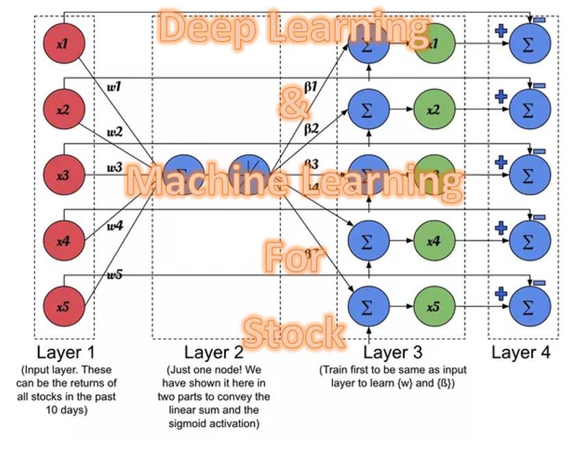

# Deep Learning and Machine Learning for Stock predictions

Description: This is for learning, studying, researching, and analyzing stock in deep learning (DL) and machine learning (ML). Predicting Stock with Machine Learning or Deep Learning with different types of algorithm. Experimental in stock data and see how it works and why it works or why it does not works that way.  

Two types of problems: Classification (predict label) and Regression (predict values)  

## List of Machine Learning Algorithms for Stock Trading  
### Most Common Regression Algorithms  
1. Simple Linear Regression Model  
2. Logistic Regression  
3. Lasso Regression    
4. Support Vector Machines  
5. Polynomial Regression  
6. Stepwise Regression  
7. Ridge Regression  
8. Multivariate Regression Algorithm    
9. Multiple Regression Algorithm  
10. K Means Clustering Algorithm  
11. Naïve Bayes Classifier Algorithm  
12. Random Forests  
13. Decision Trees  
14. Nearest Neighbours   
15. Lasso Regression  
16. ElasticNet Regression     

### Different Types of Machine Learning Algorithms and Models  
Algorithms is a process and set of instructions to solve a class of problems. In addition, algorithms perform a computation such as calculations, data processing, automated reasoning, and other tasks. 

# Prerequistes  
Python 3.5+  
Jupyter Notebook Python 3  

## Authors  
* Tin Hang

## Disclaimer  
&#x1F53B; Do not use this code for investing or trading in the stock market. However, if you are interest in the stock market, you should read :books: books that relate to stock market, investment, or finance. On the other hand, if you into quant or machine learning, read books about &#x1F4D8; machine trading, algorithmic trading, and quantitative trading. You should read &#x1F4D7; about Machine Learning and Deep Learning to understand the concept, theory, and the mathematics. On the other hand, you should read academic paper and do research online about machine learning and deep learning on :computer:  

