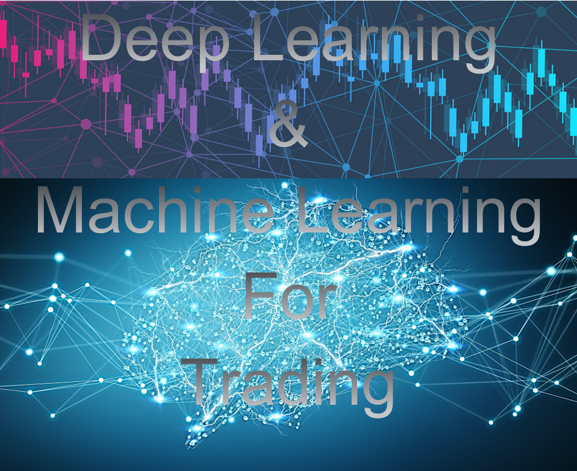

[![Contributors][contributors-shield]][contributors-url]
[![Forks][forks-shield]][forks-url]
[![Stargazers][stars-shield]][stars-url]
[![Issues][issues-shield]][issues-url]
[![MIT License][license-shield]][license-url]
[![LinkedIn][linkedin-shield]][linkedin-url]

<!-- MARKDOWN LINKS & IMAGES -->
<!-- https://www.markdownguide.org/basic-syntax/#reference-style-links -->
[contributors-shield]: https://img.shields.io/github/contributors/LastAncientOne/Deep-Learning-Machine-Learning-Stock.svg?style=for-the-badge
[contributors-url]: https://github.com/LastAncientOne/Deep-Learning-Machine-Learning-Stock/graphs/contributors
[forks-shield]: https://img.shields.io/github/forks/LastAncientOne/Deep-Learning-Machine-Learning-Stock.svg?style=for-the-badge
[forks-url]: https://github.com/LastAncientOne/Deep-Learning-Machine-Learning-Stock/network/members
[stars-shield]: https://img.shields.io/github/stars/LastAncientOne/Deep-Learning-Machine-Learning-Stock.svg?style=for-the-badge
[stars-url]: https://github.com/LastAncientOne/Deep-Learning-Machine-Learning-Stock/stargazers
[issues-shield]: https://img.shields.io/github/issues/LastAncientOne/Deep-Learning-Machine-Learning-Stock.svg?style=for-the-badge
[issues-url]: https://github.com/LastAncientOne/Deep-Learning-Machine-Learning-Stock/issues
[license-shield]: https://img.shields.io/github/license/LastAncientOne/Deep-Learning-Machine-Learning-Stock.svg?style=for-the-badge
[license-url]: LICENSE
[linkedin-shield]: https://img.shields.io/badge/-LinkedIn-black.svg?style=for-the-badge&logo=linkedin&colorB=555
[linkedin-url]: https://linkedin.com/in/tin-hang

  

<h1 align="center">Deep Learning and Machine Learning for Stock Predictions</h1>  

Description: This is a comprehensive study and analysis of stocks using deep learning (DL) and machine learning (ML) techniques. Both machine learning and deep learning are types of artificial intelligence (AI). The objective is to predict stock behavior by employing various machine learning and deep learning algorithms. The focus is on experimenting with stock data to understand how and why certain methods are effective, as well as identifying reasons for their potential limitations. Different stock strategies are explored within the context of machine learning and deep learning. Technical Analysis and Fundamental Analysis are utilized to predict future stock prices using these AI techniques, encompassing both long-term and short-term predictions.  

Machine learning is a branch of artificial intelligence that involves the development of algorithms capable of automatically adapting and generating outputs by processing structured data. On the other hand, deep learning is a subset of machine learning that employs similar algorithms but with additional layers of complexity, enabling different interpretations of the data. The network of algorithms used in deep learning is known as artificial neural networks, which mimic the interconnectedness of neural pathways in the human brain.   

Deep learning and machine learning are powerful approaches that have revolutionized the AI landscape. Understanding the fundamentals of these techniques and the commonly used algorithms is essential for aspiring data scientists and AI enthusiasts. Regression, as a fundamental concept in predictive modeling, plays a crucial role in analyzing and predicting continuous variables. By harnessing the capabilities of these algorithms and techniques, we can unlock incredible potential in various domains, leading to advancements and improvements in numerous industries.  

### Machine Learning Step-by-Step  
1. Collecting/Gathering Data.
2. Preparing the Data - load data and prepare it for the machine learning training.
3. Choosing a Model.  
4. Training the Model.  
5. Evaluating the Model.  
6. Parameter Tuning.  
7. Make a Predictions.

### Deep Learning Model Step-by-Step  
1. Define the Model.  
2. Complie the Model.  
3. Fit the Model with training dataset.  
4. Make a Predictions.  

<h3 align="left">Programming Languages and Tools:</h3>

 </a>       

### Three main types of data: Categorical, Discrete, and Continuous variables
  1. Categorical variable(Qualitative): Label data or distinct groups.    
    Example: location, gender, material type, payment, highest level of education  
  2. Discrete variable (Class Data): Numerica variables but the data is countable number of values between any two values.  
    Example: customer complaints or number of flaws or defects, Children per Household, age (number of years)  
  3. Continuous variable (Quantitative): Numeric variables that have an infinite number of values between any two values.
    Example: length of a part or the date and time a payment is received, running distance, age (infinitly accurate and use an infinite number of decimal places)  

### Data Use  
  1. For 'Quantitative data' is used with all three centre measures (mean, median and mode) and all spread measures.  
  2. For 'Class data' is used with median and mode.  
  3. For 'Qualitative data' is for only with mode.  

### Two types of problems: 
  1. Classification (predict label)  
  2. Regression (predict values)  

### Bias-Variance Tradeoff  
#### Bias  
- Bias is the difference between our actual and predicted values.  
- Bias is the simple assumptions that our model makes about our data to be able to predict new data.  
- Assumptions made by a model to make a function easier to learn.   
#### Variance  
- Variance is opposite of bias.  
- Variance is variability of model prediction for a given data point or a value that tells us the spread of our data.  
- If you train your data on training data and obtain a very low error, upon changing the data and then training the same.   

### Overfitting, Underfitting, and the bias-variance tradeoff  
Overfitted is when the model memorizes the noise and fits too closely to the training set. Good fit is a model that learns the training dataset and genernalizes well with the old out dataset. Underfitting is when it cannot establish the dominant trend within the data; as a result, in training errors and poor performance of the model. 

#### Overfitting:   
Overfitting model is a good model with the training data that fit or at lease with near each observation; however, the model mist the point and random noise is capture inside the model. The model have low training error and high CV error, low in-sample error and high out-of-sample error, and high variance.  
  1. High Train Accuracy   
  2. Low Test Accuracy
#### Avoiding Overfitting:  
  1. Early stopping - stop the training before the model starts learning the noise within the model.   
  2. Training with more data - adding more data will increase the accuracy of the modelor can help algorithms detect the signal better.     
  3. Data augmentation - add clean and relevant data into training data.  
  4. Feature selection - Use important features within the data. Remove features. 
  5. Regularization - reduce features by using regularization methods such as L1 regularization, Lasso regularization, and dropout.  
  6. Ensemble methods - combine predictions from multiple separate models such as bagging and boosting.       
  7. Increase training data.  
#### Good fit:  
  1. High Train Accuracy   
  2. High Test Accuracy   
#### Underfitting:  
Underfitting model is not perfect, so it does not capture the underlying logic of the data. Therefore, the model does not have strong predictive power with low accuracy. The model have large training set error, large in-sample error, and high bias.  
  1. Low Train Accuracy  
  2. Low Test Accuracy   
#### Avoiding Underfitting:  
  1. Decrease regularization - reduce the variance with a model by applying a penalty to the input parameters with the larger coefficients such as L1 regularization, Lasso regularization, dropout, etc.   
  2. Increase the duration of training - extending the duration of training because stopping the training early will cause underfit model.  
  3. Feature selection - not enough predictive features present, then adding more features or features with greater importance would improve the model.  
  4. Increase the number of features - performing feature engineering  
  5. Remove noise from the data    

## Python Reviews
Step 1 through step 8 is a review on python.  
After step 8, everything you need to know is relates to data analysis, data engineering, data science, machine learning, and deep learning.   
Here the link to python tutorial:  
[Python Tutorial for Stock Analysis](https://github.com/LastAncientOne/SimpleStockAnalysisPython)

## List of Machine Learning Algorithms for Stock Trading  
### Most Common Regression Algorithms  
1. Linear Regression Model  
2. Logistic Regression  
3. Lasso Regression    
4. Support Vector Machines  
5. Polynomial Regression  
6. Stepwise Regression  
7. Ridge Regression  
8. Multivariate Regression Algorithm    
9. Multiple Regression Algorithm  
10. K Means Clustering Algorithm  
11. Naïve Bayes Classifier Algorithm  
12. Random Forests  
13. Decision Trees  
14. Nearest Neighbours   
15. Lasso Regression  
16. ElasticNet Regression  
17. Reinforcement Learning  
18. Artificial Intelligence    
19. MultiModal Network  
20. Biologic Intelligence  

### Different Types of Machine Learning Algorithms and Models  
Algorithms are processes and sets of instructions used to solve a class of problems. Additionally, algorithms perform computations such as calculations, data processing, automated reasoning, and other tasks. A machine learning algorithm is a method that enables systems to learn and improve automatically from experience, without the need for explicit formulation.  

# Prerequistes  
Python 3.5+  
Jupyter Notebook Python 3    
Windows 7 or Windows 10  

### Download Software  
https://www.python.org/  

<h3 align="left"> Programming Language:</h3>

 </a>   

<h3 align="left">Tools:</h3>

 </a>      
  

  

## Authors  
### * Tin Hang

## Disclaimer  
&#x1F53B; Do not use this code for investing or trading in the stock market. However, if you are interest in the stock market, you should read :books: books that relate to stock market, investment, or finance. On the other hand, if you into quant or machine learning, read books about &#x1F4D8; machine trading, algorithmic trading, and quantitative trading. You should read &#x1F4D7; about Machine Learning and Deep Learning to understand the concept, theory, and the mathematics. On the other hand, you should read academic paper and do research online about machine learning and deep learning on :computer:  

## 🔴 Warning: This is not a financial advisor. Do not use this for investing or trading. It is for educational purposes.  
## Some codes might not work due to updates or outdated versions of certain library packages. The code will require updating, depending on the Python package library being used. Certain libraries may need to be either upgraded or downgraded.  
