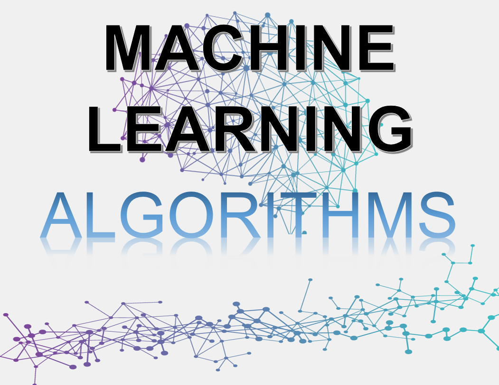

### Description:  
#### Machine learning algorithms are programs that uses math and logic to adjust themselves to perform better as they are exposed to more data. The “learning” part of machine learning means that those programs change how they process data over time, much as humans change how they process data by learning.  

### List of Commonly Used Algorithms:  
#### Linear Regression: A simple yet powerful algorithm that models the relationship between a dependent variable and one or more independent variables by fitting a linear equation to the data.  
#### Logistic Regression: Widely used for binary classification problems, logistic regression estimates the probability of an event occurring based on a set of input features.  
#### Decision Trees: These algorithms use a hierarchical structure of nodes and branches to make decisions by splitting the data based on different features. They are interpretable and often form the building blocks of ensemble methods.  
#### Random Forest: An ensemble learning method that combines multiple decision trees to make predictions. It improves upon decision trees by reducing overfitting and increasing accuracy.   
#### Support Vector Machines (SVM): SVMs aim to find the optimal hyperplane that separates data points into different classes. They work well for both linearly separable and non-linearly separable data.   
#### K-Nearest Neighbors (KNN): KNN is a non-parametric algorithm that classifies data based on the majority vote of its nearest neighbors in the feature space.  
#### Naive Bayes: A probabilistic algorithm that uses Bayes' theorem to make predictions. Despite its simplicity, it performs remarkably well in text classification and spam filtering.

### Regression in Machine Learning:  
#### Regression is a key concept in machine learning used for predicting continuous or numerical values. It analyzes the relationship between independent variables (features) and a dependent variable (target) to build a predictive model.  
### Common regression techniques include:  
#### Linear Regression: The most basic form of regression, it fits a linear equation to the data by minimizing the sum of squared residuals.  
#### Polynomial Regression: Extends linear regression by introducing polynomial terms to capture non-linear relationships between variables.   
#### Ridge Regression: Adds a regularization term to linear regression to prevent overfitting by penalizing large coefficient values.   
#### Lasso Regression: Similar to ridge regression, but it uses the absolute value of the coefficients instead of squared values, leading to sparse solutions.    
#### Support Vector Regression (SVR): An extension of SVMs for regression tasks. SVR finds a hyperplane that maximizes the margin of support vectors while minimizing the error on the training data.

# :large_blue_diamond: List of Algorithms :large_blue_diamond:  
:arrow_forward: AdaBoost Classification  
:arrow_forward: AdaBoost Regressor   
:arrow_forward: Anomaly Detection  
:arrow_forward: Apriori Algorithm  
:arrow_forward: Artificial Neural Network   
:arrow_forward: Bagging Classifier   
:arrow_forward: Bayesian Ridge Regression  
:arrow_forward: Bernoulli Restricted Boltzmann Machine  
:arrow_forward: CatBoost Algorithms    
:arrow_forward: Classification and Clustering  
:arrow_forward: Clustering Algorithms  
:arrow_forward: CART (Classification and Regression Trees)     
:arrow_forward: Decision Tree Classification   
:arrow_forward: Decision Tree Regression  
:arrow_forward: Dimensionality Reduction Algorithms  
:arrow_forward: Ensemble Learning Algorithms  
:arrow_forward: Explanatory Algorithms  
:arrow_forward: Gradient Boosting Classification  
:arrow_forward: Generative Adversarial Networks (GANs)    
:arrow_forward: K-Means Clustering Algorithm   
:arrow_forward: K-Nearest Neighbors Algorithm  
:arrow_forward: Logistic Regression    
:arrow_forward: Linear Regression    
:arrow_forward: NetworkX  
:arrow_forward: Neural Networks Regression  
:arrow_forward: Quantile Regression  
:arrow_forward: Partial Least Squares Regression (PLSR)  
:arrow_forward: Polynomial Regression    
:arrow_forward: Principal Component Classification  
:arrow_forward: Principal Component Regression  
:arrow_forward: Random Forest Classification  
:arrow_forward: Random Forest Regression   
:arrow_forward: RNN Tensorflow  
:arrow_forward: Ridge Regression  
:arrow_forward: Similarity Algorithms  
:arrow_forward: Support Vector Machines (SVM)  
:arrow_forward: Tensorflow  
:arrow_forward: Time Series  
:arrow_forward: XGBoost  

###  AdaBoost
AdaBoost is short for Adaptive Boosting and is a statistical classification meta-algorithm created by Yoav Freund and Robert Schapire in 1995. The meta-estimator begins by fitting a classifier on the original dataset and then fits additional copies of the classifier on the same dataset. However, the weights of incorrectly classified instances are adjusted such that subsequent classifiers focus more on difficult cases.      

### Anomaly Detection 
Anomaly detection is identifying data points in data that don't fit the normal patterns.  It is used for identifying rare items, events or observations which deviate significantly from the majority of the data and do not conform to a well defined notion of normal behaviour. Each node or artificial neuron is connected to another and has an associated weight and threshold. If the output of any individual node is above the specified threshold value, that node is activated and sends data to the next layer of the network. Otherwise, no data is passed along to the next layer of the network.    

### Artificial Neural Network  
Artificial neural networks (ANNs) consist of input, hidden, and output layers with connected neurons (nodes) to simulate the human brain.  

### Bagging classifier  
The Bagging classifier is an ensemble meta-estimator that fits base classifiers each on random subsets of the original dataset and then aggregates their individual predictions (either by voting or by averaging) to form a final prediction.  

### Bayesian Ridge Regression  
Bayesian Ridge Regression is similar to linear regression in which the statistical analysis is undertaken within the context of Bayesian inference. It allows a natural mechanism to survive insufficient data or poorly distributed data by formulating linear regression using probability distributors rather than point estimates.  

### Bernoulli Restricted Boltzmann Machine   
Bernoulli Restricted Boltzmann Machine (RBM) is a generative stochastic artificial neural network that can learn a probability distribution over its set of inputs.  

### Decision Tree  
The Decision Tree algorithm is a supervised machine learning technique and is used for both classification and regression.  Decision Tree uses multiple algorithms to decide to split a node into two or more sub-nodes. The creation of sub-nodes increases the homogeneity of resultant sub-nodes. However, the purity of the node increases with respect to the target variable.  

### Gradient Boosting Algorithm    
Gradient Boosting is a machine learning technique used in regression and classification. Gradient boosting works on building simple or weak prediction models sequentially where each model tries to predict the error left over by the previous model, such as overfitting.  

### K-Means Clustering Algorithm  
K-Means clustering is unsupervised machine learning algorithms and is used to solve complex machine learning problems.  

### K-Nearest Neighbors Algorithm  
K-Nearest Neighbors (KNN or k-NN) is used for a non-parametric, supervised learning classifier, which uses proximity to make classifications or predictions about the grouping of an individual data point.  

### Logistic Regression  
Logistic Regression is used for to estimate the probability of an event occurring, such as voting or didn't vote, based on a given dataset of independent variables. Since the outcome is a probability, the dependent variable is bounded between 0 and 1.  

### Linear Regression   
Linear Regression is used to model the relationship between two variables by fitting a linear equation to observed data. One variable is considered to be an explanatory variable, and the other is considered to be a dependent variable.  

### NetworkX  
NetworkX provides classes for graphs which allow multiple edges between any pair of nodes. The MultiGraph and MultiDiGraph classes allow you to add the same edge twice, possibly with different edge data. NetworkX can be powerful for some applications; however, many algorithms are not well defined on such graphs.  

### Neural Networks Regression  
Neural Networks Regression is used for to learn the linear relationship between the features and target and therefore cannot learn the complex non-linear relationship. In order to learn the complex non-linear relationship between the features and target, we are in need of other techniques.  

## Boosting Algorithms:  
### Gradient Boosting Machines (GBM):  
Gradient boosting is a machine learning technique used in regression and classification tasks, among others. It gives a prediction model in the form of an ensemble of weak prediction models, which are typically decision trees.When a decision tree is the weak learner, the resulting algorithm is called gradient-boosted trees; it usually outperforms random forests.  A gradient-boosted trees model is built in a stage-wise fashion as in other boosting methods, but it generalizes the other methods by allowing optimization of an arbitrary differentiable loss function.  

### XGBoost:  
XGBoost is a scalable and highly accurate implementation of gradient boosting that pushes the limits of computing power for boosting three algorithms, being built largely to energize machine learning model performance and computational speed.  

### LightGBM:  
LightGBN is a gradient boosting framework that uses tree-based learning algorithms.  

### Catboost:    
CatBoost is an algorithm for gradient boosting on decision trees.  

### Classification and Clustering  
Classification examples are Logistic regression, Naive Bayes classifier, Support vector machines, and others relating to classification.  However, clustering are k-means clustering algorithm, Fuzzy c-means clustering algorithm, Gaussian (EM) clustering algorithm, and other algorithms relating to clustering.  

## Authors  
### * Tin Hang  

## 🔴 Warning: This is not financial advisor.  Do not use this to invest or trade. It is for educational purpose.  
